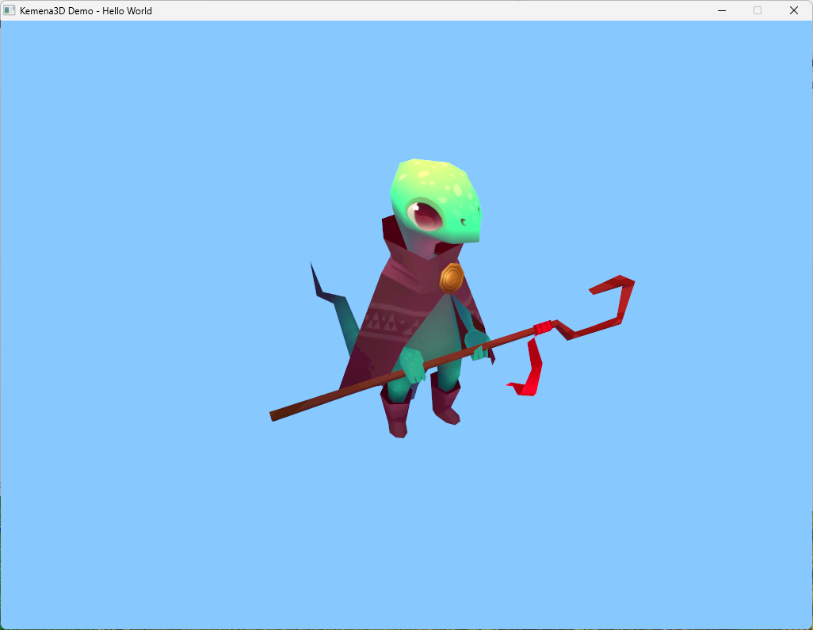

# Hello World

This demo demonstrates how to create a renderer window, load a 3D mesh and texture, and display them on the screen.

## 3D Model

Cartoon Character Reptile Mage 3D Model
- Downloaded from https://open3dmodel.com/3d-models/cartoon-character-reptile-mage_350064.html
- Removed the ground plane and adjusted the pivot point in Blender

## Screenshots

