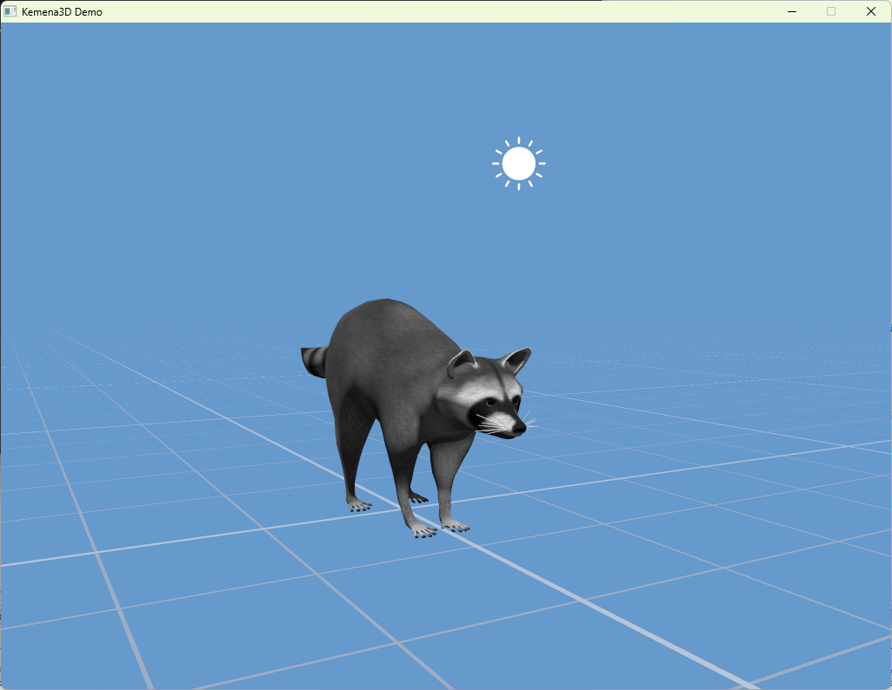
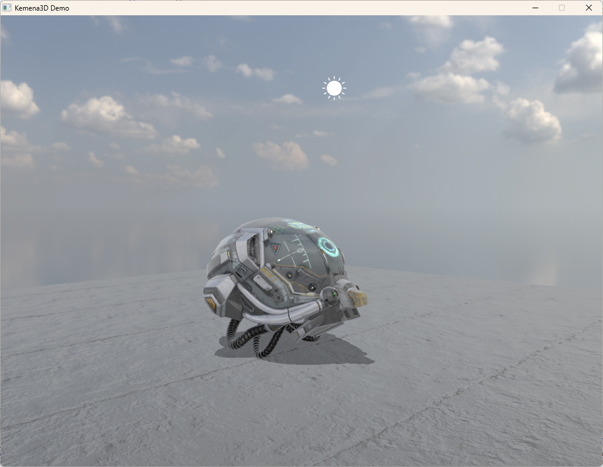
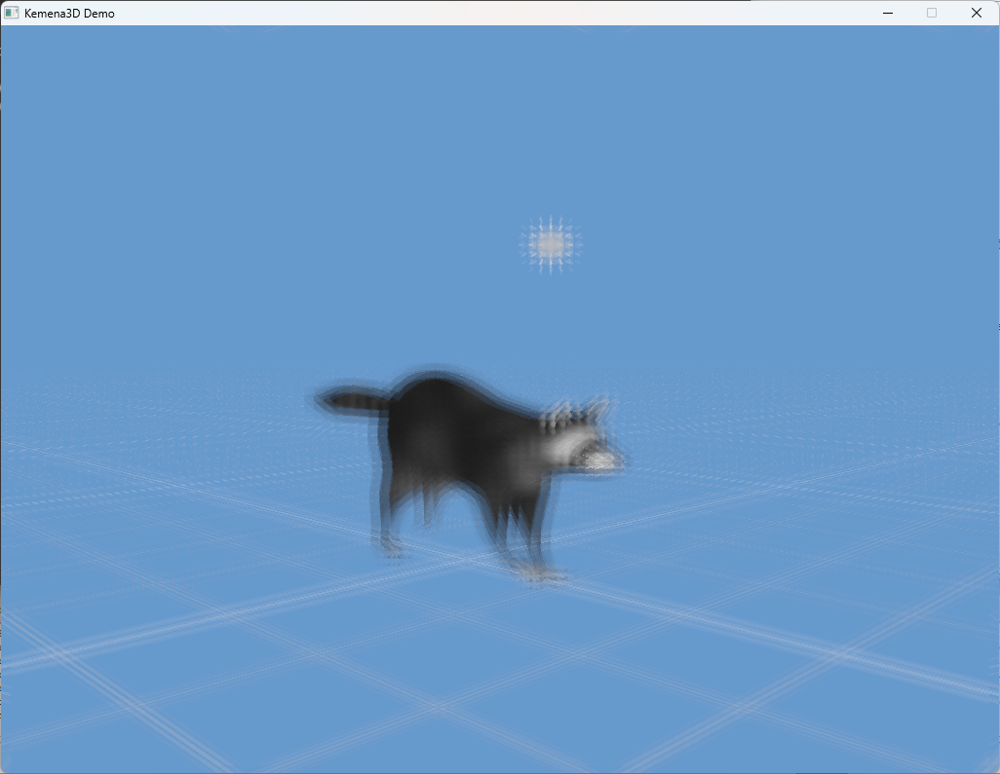
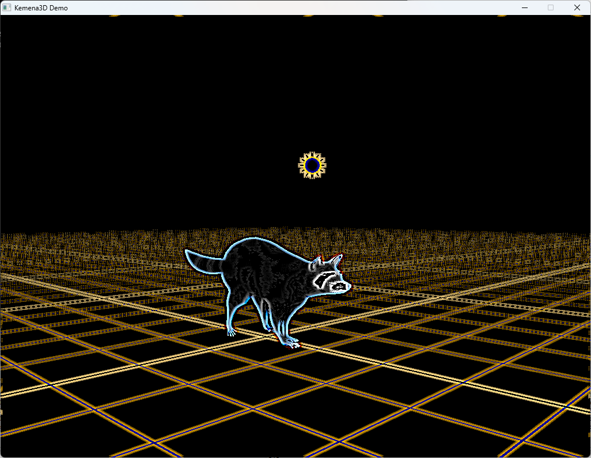

# Kemena3D SDK

Kemena3D is an open-source, cross-platform 3D rendering engine developed in C++. It’s designed for more than just game development, it’s also well-suited for simulations, interactive applications, architectural visualizations, and various other 3D use cases.

If you're looking for the game engine with complete editor - Kemena3D Studio, please visit the following page instead: https://github.com/leezhieng/kemena3d-studio

## Website

You can find the latest release, tutorials and additional information at: https://kemena3d.com

## Screenshots

